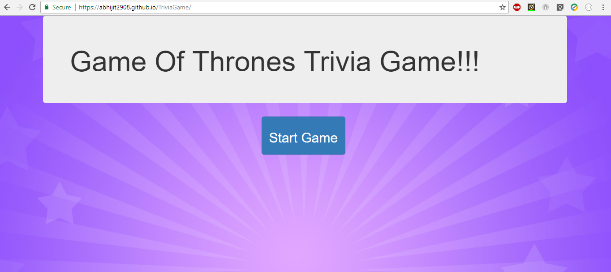
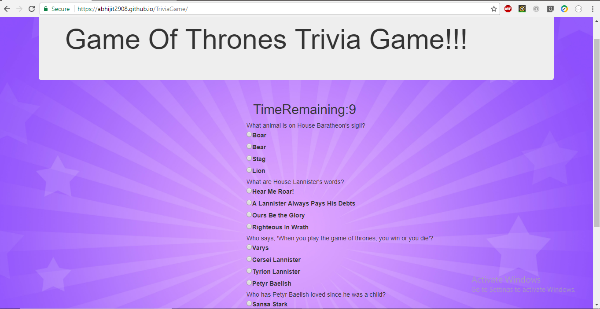
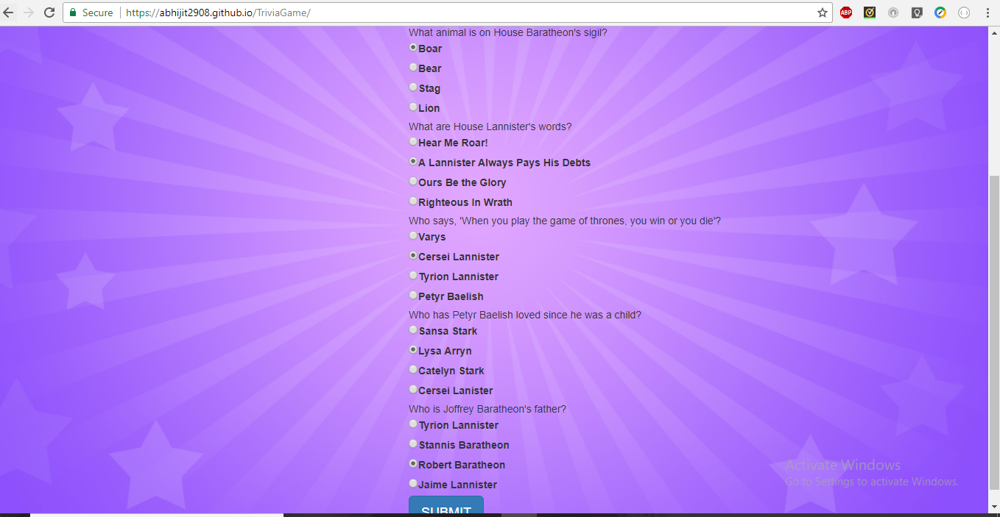
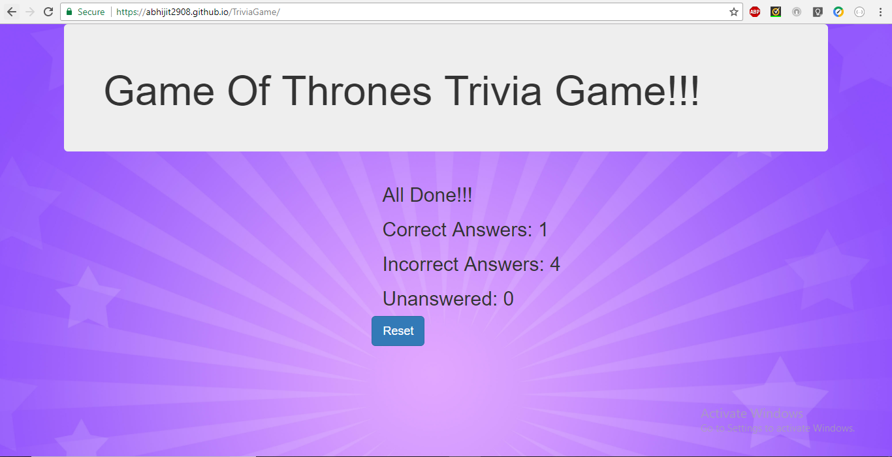
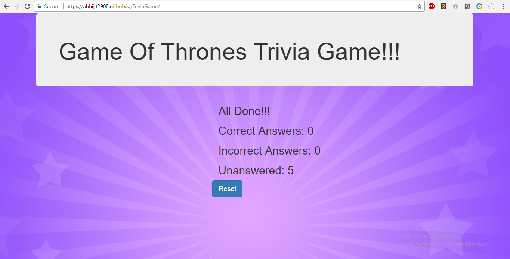

# TriviaGame

You'll create a trivia form with multiple choice or true/false options (your choice).

The player will have a limited amount of time to finish the quiz.
Don't let the player pick more than one answer per question.
 

The game ends when the time runs out. The page will reveal the number of questions that players answer correctly and incorrectly.

Don't forget to include a countdown timer.
